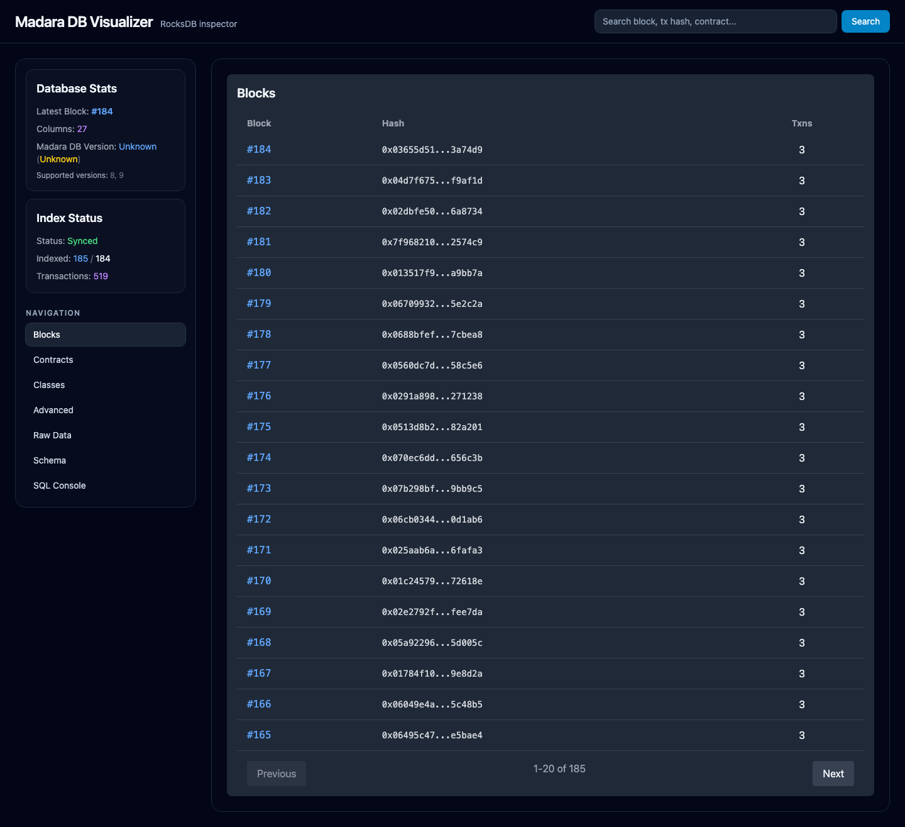
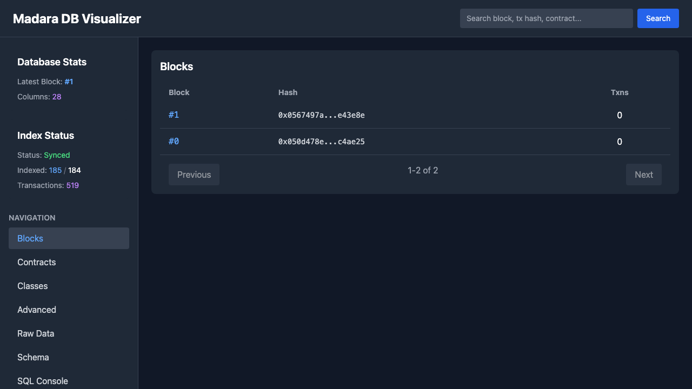
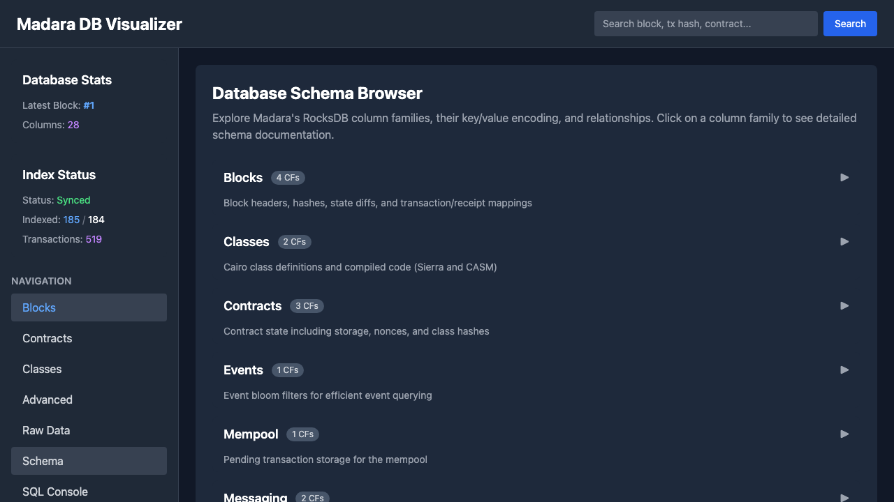
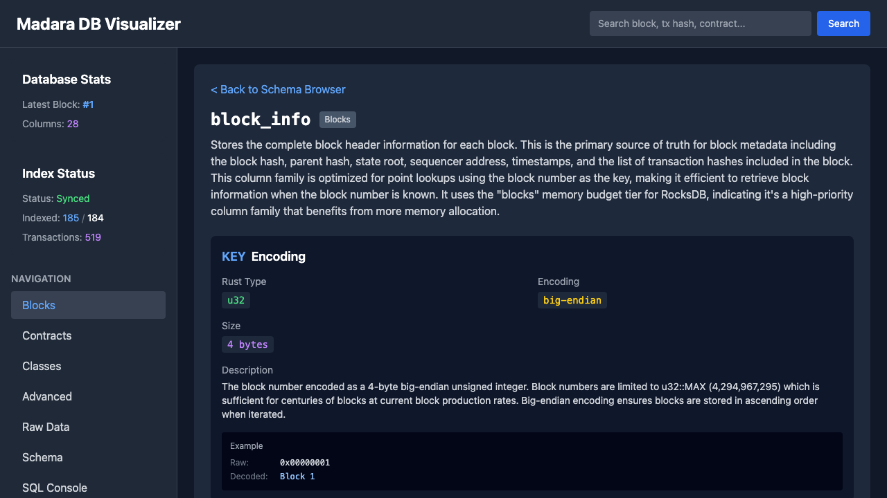
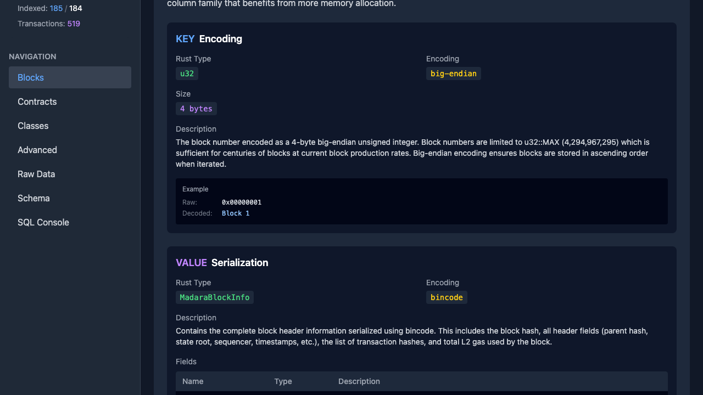
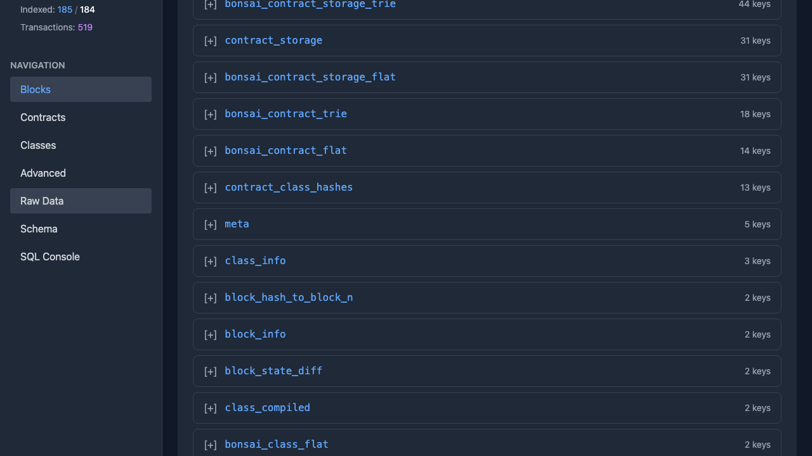
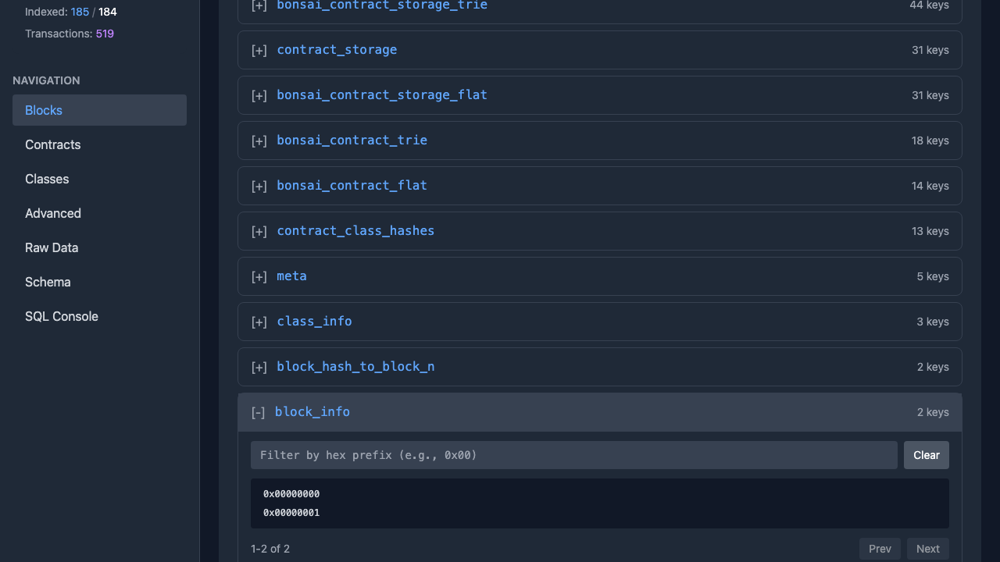
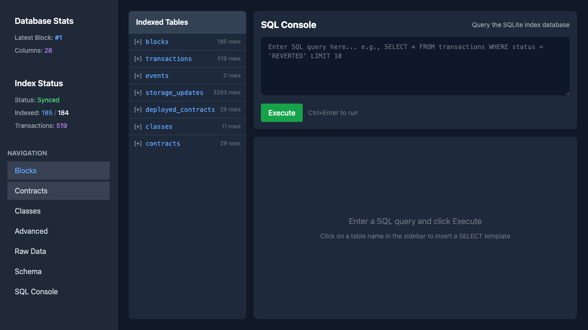
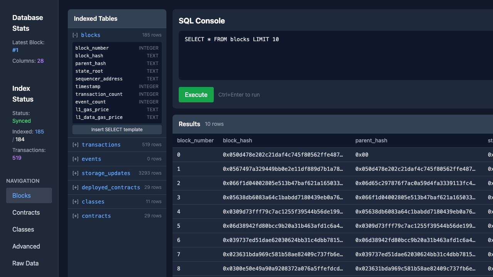

# Makimono (Madara DB Visualizer)

A web-based **Database Inspector** for Madara's RocksDB, shipped as a single command (like `rustup`/`starkliup` but for DB visualization).

Makimono detects your Madara DB schema version from `.db-version`, installs the matching visualizer toolchain, and runs the UI + API from a single port.

Note: this repository was renamed from `madara-db-visualizer` to `makimono`.

## Compatibility (Madara DB Versions)

Madara stores a DB schema version in a `.db-version` file under the Madara base path (next to the `db/` directory).

Makimono reads `.db-version` and selects a matching toolchain release tag:
- Immutable: `N.x.y` (example: `9.0.1`)
- Moving alias: `N` (example: `9`) points to the latest compatible build

If `.db-version` is missing, Makimono falls back to the highest installed toolchain (or errors if none are installed).

Currently validated: `8` and `9`.

Overrides:
- `makimono run <path> --db-version <N>` to force a toolchain version
- `makimono run <path> --offline` to disable downloads (requires the toolchain to be installed already)

## Screenshots

### Makimono (Single Port: UI + API)
Run `makimono-viz` (the toolchain binary) to serve the UI and API from the same origin.


### Docker Compose (Local)
Run the full app (API + web UI) with a single command and a local Madara RocksDB path.



### Block Explorer


### Schema Browser - Self-Documenting Database Structure
Browse all 27+ RocksDB column families with their key/value encoding documentation.



### Schema Detail - Key & Value Encoding
See exactly how keys are encoded (u64 big-endian, Felt, etc.) and values are serialized (bincode, raw bytes).




### Raw Data Browser
Inspect raw RocksDB key-value pairs in hex format with decoded hints.




### SQL Console
Write custom SQL queries against the indexed data (blocks, transactions, events, storage updates).




---

## Features

### Database Inspector (New!)
- **Schema Browser**: Self-documenting schema for all 27+ RocksDB column families
  - Key encoding details (u64 big-endian, Felt 32-bytes, composite keys)
  - Value serialization (bincode, varint, raw bytes)
  - Field descriptions and relationships between column families
- **Raw Data Browser**: Inspect raw RocksDB key-value pairs
  - Browse all column families with key counts
  - View keys in hex with prefix filtering
  - Pagination and decoded hints
- **SQL Console**: Query the SQLite index directly
  - 7 indexed tables: blocks, transactions, events, storage_updates, deployed_contracts, classes, contracts
  - Table schema sidebar with "Insert SELECT template"
  - Results table with copy-as-JSON

### Block Explorer
- **Block Browser**: Browse blocks with pagination, view block details
- **Transaction Browser**: View transactions, calldata, signatures, events
- **Contract Viewer**: Lookup contracts by address, view storage slots
- **Class Browser**: Browse Sierra/Legacy classes
- **State Diff Viewer**: See all state changes in a block
- **Universal Search**: Search by block number, tx hash, contract address, or class hash
- **Export**: Download data as JSON, copy hashes to clipboard

## Quick Start

### Option A: Makimono (Single Command, No Docker)

Makimono ships the visualizer as a **single command**, and automatically selects the correct toolchain for your Madara DB version (from `.db-version`).

If the install script returns 404s, it usually means GitHub Releases for the bootstrapper/toolchains haven't been published yet for this repo.
In that case, use Docker Compose or build locally (options below).

**Prerequisites (for install scripts):**
- macOS/Linux: `curl`, `tar`, and a SHA256 tool (`sha256sum` or `shasum` or `openssl`)
- Windows: PowerShell with `Invoke-WebRequest` and `Expand-Archive`

**Install (macOS/Linux):**
```bash
curl -fsSL https://raw.githubusercontent.com/Mohiiit/makimono/main/install.sh | bash
```

**Install (Windows PowerShell):**
```powershell
iwr -useb https://raw.githubusercontent.com/Mohiiit/makimono/main/install.ps1 | iex
```

**Run:**
```bash
# Pass either Madara base-path or RocksDB directory
makimono run ~/.madara
makimono run ~/.madara/db

# Or run the bundled sample DB
makimono run ./sample-db
```

Open `http://127.0.0.1:8080`.

**Notes:**
- You can override the detection via `--db-version <N>`.
- Use `--offline` to disable downloads (must already have the toolchain installed).
- `--open` defaults to `true` on macOS/Windows and `false` on Linux (override with `--open=true|false`).

### Option B: Docker Compose

**Prerequisites:**
- Docker Desktop (macOS/Windows) or Docker Engine (Linux)
- Docker Compose (`docker compose` or `docker-compose`)
- If your DB is outside your home directory (external SSD, etc.): allow Docker Desktop "File Sharing" access to that path (otherwise the bind mount will fail)

```bash
# Fastest demo (uses the bundled sample DB)
./scripts/up.sh

# Use your Madara DB (pass either the RocksDB dir or the Madara base-path)
./scripts/up.sh ~/.madara/db
./scripts/up.sh ~/.madara

# Pass extra docker compose args after `--` (e.g. detached)
./scripts/up.sh ~/.madara/db -- -d
```

Open http://localhost:8080 in your browser.

**Stop:**
```bash
./scripts/down.sh

# Or directly:
docker compose -f compose.yaml down
# Legacy docker-compose:
# docker-compose -f compose.yaml down
```

**Configuration (optional):**
```bash
cp .env.example .env
# edit ROCKSDB_PATH / API_PORT / WEB_PORT in .env
./scripts/up.sh
```

**Using Compose directly (optional):**
```bash
# ROCKSDB_PATH must point to the RocksDB directory (usually `<base-path>/db`), not the base-path.
ROCKSDB_PATH=~/.madara/db docker compose -f compose.yaml up --build

# If your RocksDB directory isn't literally named `db`, set DB_DIR_NAME (or use ./scripts/up.sh).
# ROCKSDB_PATH=/path/to/custom-db DB_DIR_NAME=custom-db docker compose -f compose.yaml up --build
```

### Option C: Local Build (Rust + Trunk)

#### Prerequisites

```bash
# Install Rust (if not already installed)
curl --proto '=https' --tlsv1.2 -sSf https://sh.rustup.rs | sh

# This project also builds to WASM; keep Rust reasonably up to date.
# (If you hit build errors around edition 2024 deps, upgrade your toolchain.)
rustup update

# Add WASM target
rustup target add wasm32-unknown-unknown

# Install Trunk (WASM bundler)
cargo install trunk
```

Optional (only if you want to modify/rebuild CSS locally):
```bash
# Install Node.js (for Tailwind build tooling)
# Then generate output.css from input.css
npm ci
npm run css
```

#### Step 1: Clone and Build

```bash
git clone https://github.com/Mohiiit/makimono.git
cd makimono

# Build the standalone API server (no UI embedding)
cargo build -p api --release --bin madara-db-visualizer-api

# Build embedded UI assets (required for makimono-viz)
./scripts/build_dist.sh

# Build the single-port server (UI + API)
cargo build -p api --release --features embedded-ui --bin makimono-viz
```

#### Step 2: Find Your Madara Database Path

Madara's default layout looks like:
```
<base-path>/
  .db-version         # DB schema version (optional, but used for compatibility checks)
  db/                 # RocksDB directory (pass this path to the visualizer)
    CURRENT
    *.sst
```

- **Default base-path** is usually `~/.madara`, so the RocksDB directory is `~/.madara/db`.
- If you run Madara with `--base-path /some/dir`, the RocksDB directory is `/some/dir/db`.

`./scripts/up.sh` accepts either `<base-path>` or `<base-path>/db`. The API `--db-path` expects the RocksDB directory.

The RocksDB directory should contain a `CURRENT` file (and typically `*.sst` files).

```bash
ls ~/.madara/db/CURRENT
ls ~/.madara/db/*.sst  # optional sanity check
```

#### Step 3: Start the Servers

**Option 1: Single port (UI + API):**
```bash
# Replace with your actual database path
./target/release/makimono-viz --db-path ~/.madara/db

# Or with cargo
cargo run -p api --release --features embedded-ui --bin makimono-viz -- --db-path ~/.madara/db
```

Open `http://127.0.0.1:8080`.

**Option 2: Separate ports (API + frontend dev server):**
```bash
# Terminal 1 - API server (CORS enabled)
./target/release/madara-db-visualizer-api --db-path ~/.madara/db --index-path /tmp/madara_visualizer_index.db --port 3000

# Terminal 2 - Serve the built frontend
cd crates/frontend/dist
python3 -m http.server 8080
```

#### Step 4: Open the Visualizer

Open http://localhost:8080 in your browser.

If you're using separate ports, you may need to set the API base via `?api=http://127.0.0.1:3000` (or via `localStorage["api_url"]`).

## Configuration

### API Server Options

```bash
./target/release/madara-db-visualizer-api --help

Options:
  --db-path <PATH>      Path to the Madara RocksDB database directory (usually `<base-path>/db`)
  --index-path <PATH>   Path to the SQLite index database
  --port <PORT>         API server port [default: 3000]
```

### Environment Variables

```bash
# Use local target directory (useful if default is on external SSD)
CARGO_TARGET_DIR=target cargo build -p api --release
```

## API Endpoints

### Block Explorer
| Endpoint | Description |
|----------|-------------|
| `GET /api/health` | Health check |
| `GET /api/stats` | Database statistics |
| `GET /api/blocks?offset=0&limit=20` | List blocks |
| `GET /api/blocks/:number` | Block details |
| `GET /api/blocks/:number/transactions` | Block transactions |
| `GET /api/blocks/:number/state-diff` | Block state diff |
| `GET /api/contracts/:address` | Contract details |
| `GET /api/classes/:hash` | Class details |
| `GET /api/search?q=<query>` | Universal search |

### Schema Documentation
| Endpoint | Description |
|----------|-------------|
| `GET /api/schema/categories` | List schema categories |
| `GET /api/schema/column-families` | List all CF schemas |
| `GET /api/schema/column-families/:name` | Detailed CF schema |

### Raw Data Inspection
| Endpoint | Description |
|----------|-------------|
| `GET /api/raw/cf` | List all column families with key counts |
| `GET /api/raw/cf/:name/stats` | CF statistics (first/last key) |
| `GET /api/raw/cf/:name/keys?limit=50&offset=0` | List keys in hex |
| `GET /api/raw/cf/:name/key/:key_hex` | Get value for key |
| `POST /api/raw/cf/:name/keys/batch` | Batch fetch keys |

### SQL Index
| Endpoint | Description |
|----------|-------------|
| `GET /api/index/status` | Index sync status |
| `GET /api/index/tables` | List indexed tables |
| `GET /api/index/tables/:name/schema` | Table schema |
| `POST /api/index/query` | Execute SQL query |

**SQL Query Example:**
```bash
curl -X POST http://localhost:3000/api/index/query \
  -H "Content-Type: application/json" \
  -d '{"sql": "SELECT * FROM blocks ORDER BY block_number DESC LIMIT 5", "params": []}'
```

## Project Structure

```
makimono/
├── Cargo.toml              # Workspace root
├── crates/
│   ├── api/                # Axum HTTP server
│   ├── db-reader/          # RocksDB access layer
│   ├── frontend/           # Leptos WASM frontend
│   │   └── dist/           # Built frontend assets
│   ├── indexer/            # SQLite indexer
│   ├── schema/             # YAML schema definitions
│   └── types/              # Shared types
└── README.md
```

## Troubleshooting

### "Database path does not exist"
Ensure `--db-path` points to the RocksDB directory (usually `<base-path>/db`) containing a `CURRENT` file / `.sst` files:
```bash
ls /path/to/db/*.sst  # Should list SST files
```

### Madara DB version compatibility (`.db-version`)
The API reports the detected Madara DB schema version in `GET /api/stats` (from `<base-path>/.db-version`, next to the `db/` directory).

Currently validated: `8` and `9`. Other versions may still load, but decoding/indexing may be incomplete.

Notes:
- `.db-version` is a simple UTF-8 text file containing a single decimal `u32`.
- With Docker Compose, we bind-mount the RocksDB *parent* directory so the container can see `<base-path>/.db-version`.

## Releases / Tagging

This repo tags toolchain releases by the **Madara DB schema version** (`.db-version`) to make compatibility obvious.

Toolchain policy:
- Immutable releases: `<db_version>.<major>.<patch>` (example: `9.0.1`)
- Moving alias tag: `<db_version>` (example: `9`) always points to the latest compatible build for that DB version

Bootstrapper policy:
- Immutable releases: `makimono-<semver>` (example: `makimono-0.1.0`)
- Moving alias tag: `makimono`

### Port already in use
```bash
# Kill processes on ports 3000 and 8080
lsof -ti:3000,8080 | xargs kill -9
```

### WASM build fails
```bash
rustup target add wasm32-unknown-unknown
```

### Permission denied (external SSD)
```bash
CARGO_TARGET_DIR=target cargo build -p api --release
```

### Stale index data
Delete the SQLite index to rebuild:
```bash
rm /tmp/madara_visualizer_index.db
```
If you started via Docker Compose, the index is stored in a Docker volume:
```bash
docker compose -f compose.yaml down -v
```

## Development

```bash
# Run tests
cargo test --workspace

# Build all crates
cargo build --release

# Frontend with hot reload
cd crates/frontend
trunk serve index.html
```

## License

MIT. See `LICENSE`.
