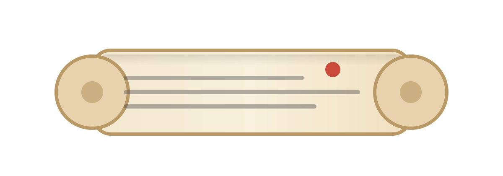

# Makimono

<p align="center">
  
</p>

<p align="center">
  <b>Scroll your Madara RocksDB into a UI, in one command.</b>
</p>

[](https://github.com/Mohiiit/makimono/actions/workflows/deploy.yml)
[](LICENSE)

Makimono is a `rustup`-style toolchain manager + visualizer for Madara's RocksDB.
Point it at a DB directory, and it will:

- detect the Madara DB schema version from `.db-version`
- install the matching visualizer toolchain
- run a single server: UI at `/` and API at `/api/*`


## Quickstart (No Docker)

### 1) Install

macOS/Linux:
```bash
curl -fsSL https://raw.githubusercontent.com/Mohiiit/makimono/main/install.sh | bash
```

Windows PowerShell:
```powershell
iwr -useb https://raw.githubusercontent.com/Mohiiit/makimono/main/install.ps1 | iex
```

Developer fallback (build from source):
```bash
cargo install --git https://github.com/Mohiiit/makimono.git --bin makimono
```

### 2) Run

Pass either the Madara base path or the RocksDB directory:
```bash
makimono run ~/.madara
makimono run ~/.madara/db

# Or run the bundled sample DB
makimono run ./sample-db
```

Open `http://127.0.0.1:8080`.

## Why "Makimono"?

In Naruto, a *makimono* is a scroll: compact, portable, and used to carry the important stuff.

That’s the vibe here: Makimono carries the right visualizer for your DB schema version.

## Naming

- `makimono`: the end-user CLI you install and run (`makimono run ...`)
- `makimono-viz`: the versioned toolchain binary that Makimono downloads and executes
- "Madara DB Visualizer": the web UI title (served by `makimono-viz`)

This repo was previously named `madara-db-visualizer`.

## Doctor

If `makimono run` fails (or before running on a new machine/DB), run:

```bash
makimono doctor /path/to/madara
# or
makimono doctor /path/to/madara/db
```

`doctor` prints actionable checks (DB path, `.db-version`, toolchain availability, network reachability) and exits non-zero if it finds a blocking issue.

## Requirements (End Users)

- macOS/Linux: `curl`, `tar`, and a SHA256 tool (`shasum -a 256` or `sha256sum`).
- Windows: PowerShell, and the default Windows archive tooling is enough for `install.ps1`.

If you're on a locked-down network, ensure GitHub Releases are reachable (Makimono downloads toolchains from releases).

## Compatibility (Madara DB Versions)

Madara stores a DB schema version in a `.db-version` file under the base path (next to `db/`).

Makimono reads `.db-version` and selects a matching toolchain release tag:
- Immutable: `N.x.y` (example: `9.0.1`)
- Moving alias: `N` (example: `9`) points to the latest compatible build

If `.db-version` is missing, Makimono falls back to the highest installed toolchain (or errors if none are installed).

Currently validated: `8` and `9`.

Useful overrides:
- `makimono run <path> --db-version <N>`
- `makimono run <path> --offline`

## How It Works

- `makimono` (bootstrapper) resolves the DB directory, reads `.db-version`, downloads the matching toolchain from GitHub Releases, and runs it.
- `makimono-viz` (toolchain) is a single binary that serves the embedded frontend at `/` and the API at `/api/*`.

## Docker Compose (Optional)

If you prefer Docker for local runs:
```bash
./scripts/up.sh                # uses ./sample-db
./scripts/up.sh ~/.madara      # or ~/.madara/db
```

Open `http://localhost:8080`.

## Documentation

- API endpoints: `docs/API.md`
- Development notes: `docs/DEVELOPMENT.md`
- Maintainer scratchpad: `docs/makimono-scratchpad.md`
- Screenshot gallery: `docs/images/`

## License

MIT. See `LICENSE`.
